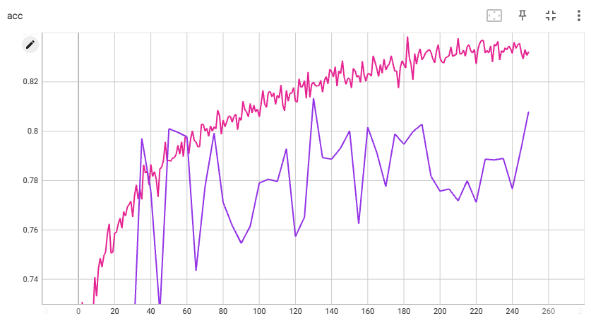
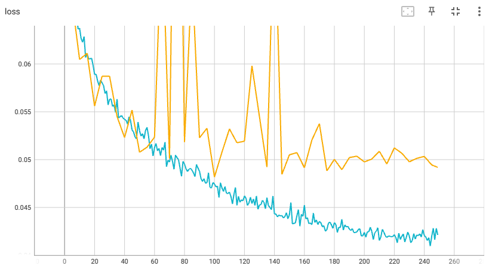
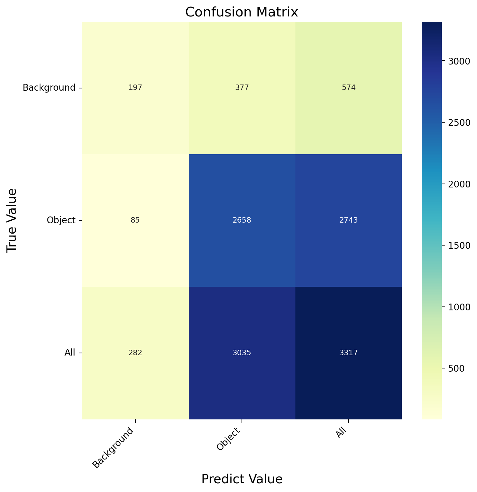

### 记录实验结果
***
#### 实验参数
* 二分类 epoch：250 batch_size:16 lr=0.001 lrf=0.01 eval_interval=5
* 10419 images for training. 3317 images for validation.
* acc: 
* loss:
* 混淆矩阵：
* 分类消耗时间：1分30秒  batch_size:64 速度 1.74s/it