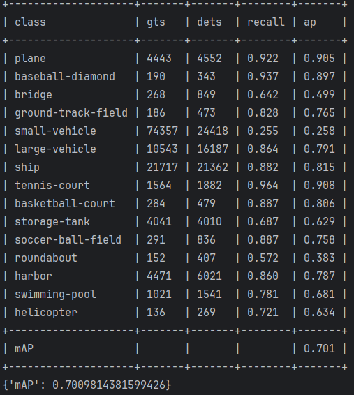
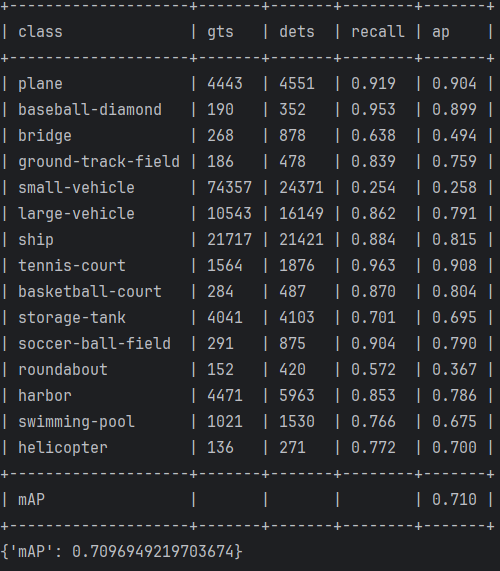

### 记录实验结果
***
#### 实验参数
* 二分类 epoch：250 batch_size:16 lr=0.001 lrf=0.01 eval_interval=5
* 10419 images for training. 3317 images for validation.
* acc: 
* loss:
* 混淆矩阵：
* 分类消耗时间：1分30秒  batch_size:64 速度 1.74s/it
* 将检测无目标变为黑图，测试3317/3317, 21.3 task/s, elapsed: 155s
* 剔除分类器识别无目标的图片， 测试3036/3036, 20.8 task/s, elapsed: 146s
* 测试结果：
* 总耗时：90 + 146 = 236s

***

* 多标签分类 epoch：250 batch_size:16 lr=0.001 lrf=0.01 eval_interval=5
* 10419 images for training. 3317 images for validation.
* acc: 
* loss: 
* 混淆矩阵： 
* 分类消耗时间：1分32秒  batch_size:64 速度 1.77s/it
* 将检测无目标变为黑图，测试3317/3317, 20.9 task/s, elapsed: 159s
* 剔除分类器识别无目标的图片， 测试3148/3148, 21.4 task/s, elapsed: 147s
* 测试结果：
* 总耗时： 92 + 147 = 239s

***

* 带有分割分支 epoch：200 batch_size:14 lr=0.001 lrf=0.01 eval_interval=5
* acc: 
* loss: 
* 混淆矩阵： 
* 分类时间： 1分29秒  batch_size:64 1.72s/it
* 将检测无目标变为黑图，测试3317/3317, 20.9 task/s, elapsed: 158s
* 剔除分类器识别无目标的图片， 测试2931/2931, 20.8 task/s, elapsed: 141s
* 测试结果：
* 总耗时： 89 + 141 = 230s

***

* 二分类（ResNet) epochs=200, batch_size=16, lr=0.001, lrf=0.01, eval_interval=5
* acc: 
* loss: 

***

* 多标签分类（ResNet) epochs=200, batch_size=16, lr=0.001, lrf=0.01, eval_interval=5
* acc: 
* loss: 

***

* 带分割分支（ResNet) epochs=200, batch_size=16, lr=0.001, lrf=0.01, eval_interval=5
* acc: 
* loss: 
* 混淆矩阵： 
* 测试结果： 
* 剔除分类器识别无目标的图片， 测试3090/3090, 21.4 task/s, elapsed: 144s
* 总耗时：90 + 158 = 248s