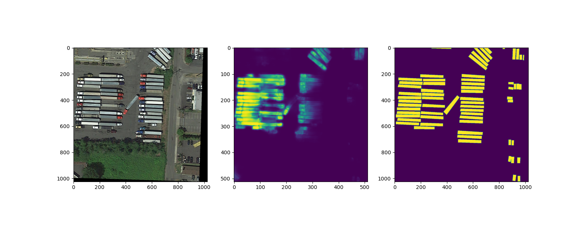

#### 这个项目是用来测试，增加图像显著区域预测分支对分类的影响
***
### tools文件夹下内容
- annShow.py：读取Label并向检测框绘制在图片上
- gen_mask.py：生成遮罩图片，用于训练分割分支
- notDetectionPicture.py:将FP/FN图片复制到单独的文件夹中
- processImg.py:将没有检测到目标的图片变成黑图
- ExtractImg.py:将不是GoogleEarth的图片屏蔽
***
### 主目录下内容
- model.py:模型文件
- model_with_fpn.py：带有图像特征金字塔的模型文件
- my_dataset.py:构建数据集
- predict.py:推理
- train.py:训练脚本
***
##### 下面是两种阈值产生的结果
* (有分支)阈值固定为0.5时生成的混淆矩阵

* (无分支)

* (有分支)利用F1 Score计算出的最佳阈值，生成的混淆矩阵 

* (无分支)

***
##### 下面是显著区域的预测效果

